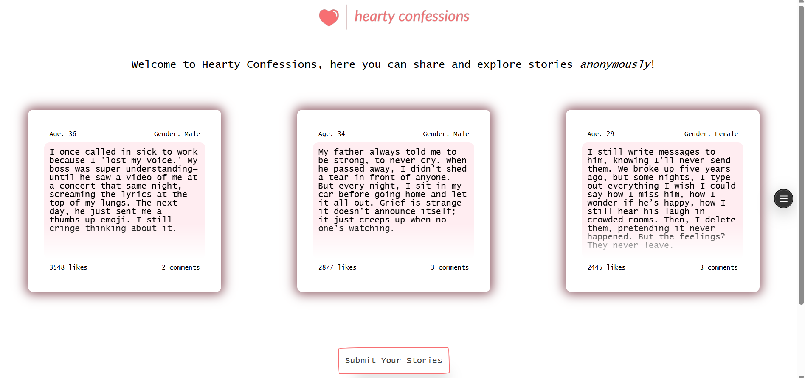

# Hearty Confessions

<!-- Place your homescreen screenshot in the public/assets directory and update the src below -->


[Live Demo](https://heartyconfessions-next-git-master-dedebarshis-projects.vercel.app/)

Hearty Confessions is a modern web application where users can share and explore stories anonymously. Built with Next.js and MongoDB, it offers a safe space for open expression, community engagement, and discovery of heartfelt stories.

---

## Features
- **Anonymous Story Submission:** Share your confessions or stories without revealing your identity.
- **Explore Stories:** Browse and discover confessions from others, filter by category, and view popular posts.
- **Comment & Like:** Engage with stories by leaving comments and likes.
- **Responsive UI:** Clean, modern, and mobile-friendly interface.
- **API Routes:** RESTful endpoints for submitting, listing, liking, and commenting on confessions.

---

## Tech Stack
- **Frontend:** Next.js (React), CSS Modules
- **Backend:** Next.js API Routes
- **Database:** MongoDB (via Mongoose)
- **Deployment:** Vercel

---

## Getting Started

To run the project locally:

```bash
npm install
npm run dev
```

Open [http://localhost:3000](http://localhost:3000) in your browser.

---

## Folder Structure
- `src/app/` — Next.js app directory (pages, API routes)
- `src/components/` — Reusable UI components
- `src/models/` — Mongoose models
- `src/lib/` — Database connection logic
- `public/` — Static assets

---

## Future Enhancements
- User authentication (optional anonymity)
- Story moderation/admin panel
- Advanced search and filtering
- Notifications for comments/likes
- Improved analytics/dashboard

---

## About
This project was created as a demonstration of full-stack web development skills using modern technologies. For more information or to connect, please visit the [live demo](https://heartyconfessions-next-git-master-dedebarshis-projects.vercel.app/).
